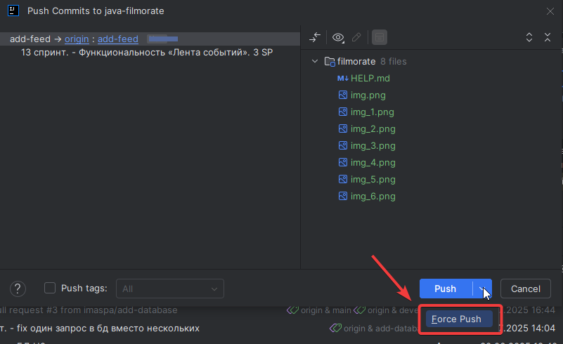

# java-filmorate

### Стратегия мержа: Rebase
Работа строится следующим образом:
- от ветки **develop** создаем собственную ветку (н.р. add-feed) и переходим в нее

- выполняем работы в своей ветке
- выполняем локальный коммит

- обновляем **ОСНОВНУЮ ВЕТКУ** (в нашем случае develop)

- выполняем Rebase ветки в которой вели разработку (add-feed)

- отправляем изменения на удаленный сервер

## Дальнейшие действия зависит от наличия ветки на удаленном сервере
- если ветки **нет на удаленном сервере** (если около имени ветки есть надпись _new_ - значит ветке нет на удаленном сервере)
  - выполняем **Push**
    
  
      
- если ветка **есть на удаленном сервере**
  - выполняем **Force Push**
  
  
