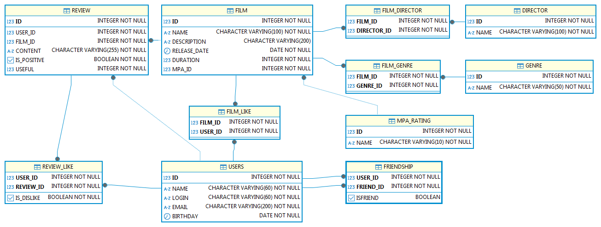

# java-filmorate

## ER-диаграмма для БД filmorate

## Структуры БД
TEST2
## **USERS**
Информацию о пользователях

Поля:
* *ID* - Идентификатор пользователя;
* *NAME* - Имя пользователя;
* *LOGIN* - Логин пользователя;
* *EMAIL* - Адрес электронной почты;
* *BIRTHDAY* - Дата рождения;

## **FRIENDSHIP**
Информация о друзьях

Поля:
* *USER_ID* - Идентификатор пользователя;
* *FRIEND_ID* - Идентификатор друга;
* *ISFRIEND* - Признак дружбы;

## **FILM_LIKE**
Информация о лайках

Поля:
* *FILM_ID* - Идентификатор фильма;
* *USER_ID* - Идентификатор пользователя;

## **MPA_RATING**
Информация о рейтинге ассоциации кинокомпаний

Поля:
* *ID* - Идентификатор рейтинга;
* *name* - Наименование рейтинга;

## **GENRE**
Информация о жанрах

Поля:
* *ID* - Идентификатор жанр;
* *NAME* - Наименование жанра;

## **FILM**
Информация о фильмах

Поля:
* *ID* - Идентификатор фильма;
* *NAME* - Наименование фильма;
* *DESCRIPTION* - Описание фильма;
* *RELEASE_DATE* - Дата выхода фильма;
* *DURATION* - Продолжительность фильма;
* *MPA_ID* - рейтинг фильма;

## **FILM_GENRE**
Информация о жанрах фильма

Поля:
* *FILM_ID* - Идентификатор фильма;
* *GENRE_ID* - Идентификатор жанра;
